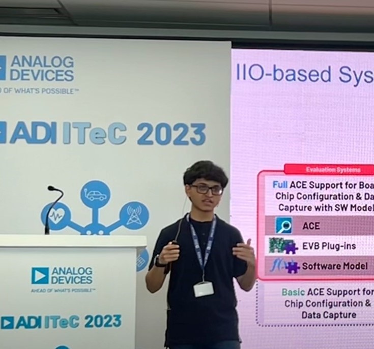

About Me
--------

I am a Master's student at Georgia Tech, majoring in Electrical and Computer Engineering. I love to work on 
the fine line dividing Hardware and Software. I used to work as an Embedded Software Engineer at Analog Devices, India - and got
my first, official introduction to the world of logic analyzers, microcontroller firmware, schematics and FPGAs there. 

Dirtying my hands debugging software and hardware in a professional environment gave me the much needed confidence to explore and cut my teeth on
on even more exciting topics in computer architecture. At Georgia Tech and beyond, I am eager to 
work on GPUs, TPUs, DSPs and their likes where you have to count cycles and try every trick in the book (or invent new ones!) to squeeze the most performance out
of the hardware.